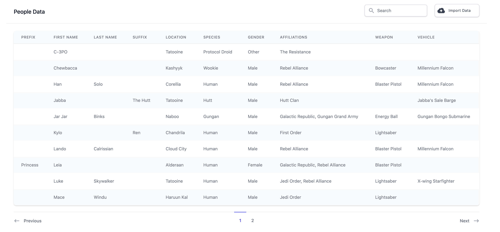

# Sentia Coding Test

An example [Ruby on Rails][] application that can import information and display
it.



The application comes from a coding test, and I decided to take it on just
because I felt like I had not created a Rails application from scratch for a
while.

Currently deployed [here][sentiacodingtest] using [Heroku][].

## Language Versions

- [Ruby][] 3.0.0
- Rails 6.1.1
- [NodeJS][] 14.5.0

## Setup

```sh
git clone https://github.com/paulfioravanti/sentia-coding-test.git
cd senta-coding-test
bundle install
bin/rails db:create db:migrate
yarn
```

## Run

```sh
bin/rails server
```

Open <http://localhost:3000> in a browser and you should be greeted with
an empty table.

## Sample Data

### Import via User Interface

The original CSV file containing the data that the application must be able to
import can be found at:

```
test/fixtures/files/SentiaCodingTestData.csv
```

This is the file that can be selected upon pressing the "Import Data" button
to import the required data.

### Import via Fixtures

During development, I also recreated the seed data in Rails fixtures files,
which can be found under the `test/fixtures` directory. These can be loaded
into the database on the command line:

```sh
bin/rails db:fixtures:load
```

### Import via Rails Console

I often tested the logic in the file importer modules themselves via the Rails
console, so the data can also be imported in the following way:

```sh
bin/rails console
irb(main):001:0> file = File.open("#{Rails.root}/test/fixtures/files/SentiaCodingTestData.csv")
irb(main):002:0> DataImporter.import(file)
```

## Tests

No tests. Too lazy for this one.

## Original Requirements

You will be required to create a Ruby on Rails application with the following
features below. The sample CSV data required for the test can be found
[here][sample-csv-link]. This application can be built in 1 hour.

Below is a list of user stories and requirements for each section of this
application.

**PART 1**

1. As a user, I should be able to upload this sample CSV and import the data
   into a database.

   IMPORTER REQUIREMENTS
    
   a. The data needs to load into 3 tables. **People**, **Locations** and
      **Affiliations**<br />
   b. A **Person** can belong to many **Locations**<br />
   c. A **Person** can belong to many **Affiliations**<br />
   d. A **Person** without an **Affiliation** should be skipped<br />
   e. A **Person** should have both a _first_name_ and _last_name_. All fields
      need to be validated except for _last_name_, _weapon_ and _vehicle_ which
      are optional.<br />
   f. Names and Locations should all be titlecased

**PART 2**

1. As a user, I should be able to view these results from the importer in a
   table.
2. As a user, I should be able to paginate through the results so that I can see
   a maximum of 10 results at a time.
3. As a user, I want to type in a search box so that I can filter the results I
   want to see.
4. As a user, I want to be able to click on a table column heading to reorder
   the visible results.

Once the test has been completed. Please upload to Git Repo/Google Drive/DropBox
or zip and email over back to [person] at [person's email].

## Commentary

> This application can be built in 1 hour.

If this is true, then I am a terrible developer, as it took me a fair bit longer
than that. Anyway...

### Data Issues

There is no doubt that the data in the CSV file to import is meant to contain
some corrupt/bad data that you are meant to be able to program defensively
against.

My general intentions were to only not import an entry where the requirements
specifically said not to (ie a person without an affiliation), and where the
data could not be _reasonably_ [munged][] into an acceptable format.

#### Mis-spellings

So, this meant that `Lightsaber~!@@@` could just be stripped of non alphanumeric
characters and become a valid `Lightsaber`, but there were also issues around
mis-spellings in the data where I needed to give the application more knowledge
around what kind of values it could expect to find in the CSV file and deal
with them. This occurred in the
`app/services/data_importer/enum_field_parser.rb` file:

```ruby
MISSPELLINGS = {
  "Yoda's Hutt" => "Yoda's Hut",
  "Naboo N-1 Starfigher" => "Naboo N-1 Starfighter"
}
```

I am pretty sure that Yoda does not own a pet Jabba.

#### Value Validity

Under C-3PO's entry, the value for the Vehicle is given as `-1`, an obvious
ploy to make sure that you do not actually store this value in a Person's
vehicle field.

However, if `-1` is not a valid entry, and therefore I cannot trust the values
in the file, then I need to give the application advance knowledge on what
vehicles it can accept as valid. So, this meant I ended up making every
non-name-related Person field an enumerated type, both in the application and at
the database level.

The fact that there was the spelling mistake for Yoda's location also made me
assign enumerated types for the names of Locations and Affiliations. The
application really does have too much advance knowledge of the limited scope
of valid values it could get from the CSV file, but I did not see any other way
around it.

#### Names

The requirements assume that the name values in the CSV file can be split out
into _first_name_ and _last_name_, which, taken at face value, they certainly
can.

However, this leads to the issue of having a table that looks like this for
some values:

|First Name|Last Name|
|----------|---------|
|Princess  |Leia     |
|Darth     |Vader    |
|Kylo      |Ren      |
|Jabba     |The Hutt |

- "Princess" is a title, not a name, and "Leia" is Leia Organa's first name
- ["Darth" is a title][Darth], not a name, and "Vader" is more like a first name
- "Ren" is not a last name, but is from [Knights of Ren][], and Kylo uses it
  more like a title once he became the inheritor of Ren's Knights.
- "The Hutt" is not a last name, but refers to the [Hutt species][Hutt].

So, although not part of the requirements, I figured that this meant that the
application really needed to deal with the concept of name prefixes (titles etc)
and [suffixes][Suffix]. The ability to deal with this was made a bit more
straightforward thanks to Ruby 3.0's [pattern matching][] capabilities (see
`app/services/data_importer/person_parser.rb`).

Also, for names like "Jabba The Hut" and "Jar Jar Binks", without the
application knowing in advance that "The Hutt" is a suffix, it would not be
able to tell the which words in either of those names comprise the _first_name_
or _last_name_.

### User Interface

Since interface design and making things pretty in general is a weak-point for
me, I wanted to try out using [Tailwind CSS][] to style everything on the page,
as well as use [Tailwind UI][] to hopefully be able to grab ready-made code
for certain types of components.

For the most part this was true for the table, upload button, search bar, and
pagination widget, but, as would be expected, it's not quite as simple as plug
and play. Integrating Tailwind into the [Kaminari][]-generated pagination views
probably took the most amount of time.

For the most part, I just left the long-classname styles in the Rails view
files, but for tags that had classes that used a significant amount of
mnemonics, breaking multiple lines on the page and generally being hard to read,
I extracted those into separate SCSS files using Tailwind's [`@apply`][]
directive.

### Be as Rails-y as Possible

There are likely ways I could have integrated more [Javascript][] into the
application and have it do more with search or sorting, but since this problem
was specifically meant to be a Rails application, I decided to go as "vanilla"
Rails as possible.

I also tried to use the least amount of third-party non-Rails-default gems as
possible, only using:

- [ActiveRecord::PGEnum][] due to it's nice developer ergonomics in dealing with
  Postgres enumerated types
- [Draper][] for decorators. I really do not like using Rails helpers for
  presentation logic.
- [Kaminari][] for pagination, as I think it is the best gem for it.

[ActiveRecord::PGEnum]: https://github.com/alassek/activerecord-pg_enum
[`@apply`]: https://tailwindcss.com/docs/functions-and-directives#apply
[Darth]: https://starwars.fandom.com/wiki/Darth
[Draper]: https://github.com/drapergem/draper
[Heroku]: https://www.heroku.com
[Hutt]: https://starwars.fandom.com/wiki/Hutt
[Javascript]: https://developer.mozilla.org/en-US/docs/Web/JavaScript
[Kaminari]: https://github.com/kaminari/kaminari
[Knights of Ren]: https://starwars.fandom.com/wiki/Knights_of_Ren
[munged]: https://en.wikipedia.org/wiki/Data_wrangling
[NodeJS]: https://nodejs.org/en/
[pattern matching]: https://docs.ruby-lang.org/en/3.0.0/doc/syntax/pattern_matching_rdoc.html
[Ruby]: https://www.ruby-lang.org/en/
[Ruby on Rails]: https://rubyonrails.org/
[sample-csv-link]: https://docs.google.com/spreadsheets/d/10c7r-kjdWM4L8kWK0nfE6JgHskzqp7DTF8MkUIo7-_o/edit?usp=sharing
[sentiacodingtest]: http://sentiacodingtest.herokuapp.com/
[Suffix]: https://en.wikipedia.org/wiki/Suffix_(name)
[Tailwind CSS]: https://tailwindcss.com/
[Tailwind UI]: https://tailwindui.com/
