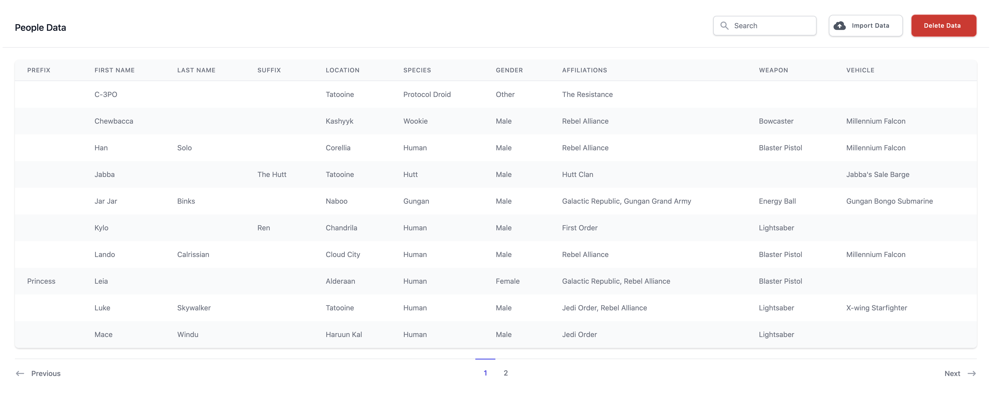

# Sentia Coding Test

An example [Ruby on Rails][] application that can import information and display
it.



The application comes from a coding test, and I decided to take it on just
because I felt like I had not created a Rails application from scratch for a
while.

I wrote more about this in a blog post, _[Coding Test Review: Sentia][]_.

Currently deployed [here][sentiacodingtest] using [Heroku][].

## Language Versions

- [Ruby][] 3.0.2
- Rails 6.1.4
- [NodeJS][] 14.6.1 (locked to version 14.x since it is the latest [node-sass][]
  currently [supports][node-sass supported environments])

## Setup

```sh
git clone https://github.com/paulfioravanti/sentia-coding-test.git
cd senta-coding-test
bundle install
bin/rails db:init
yarn
```

## Run

```sh
bin/rails server
```

Open <http://localhost:3000> in a browser and you should be greeted with
an empty table.

## Sample Data

### Import via User Interface

The original CSV file containing the data that the application must be able to
import can be found at:

```
test/fixtures/files/SentiaCodingTestData.csv
```

This is the file that can be selected upon pressing the "Import Data" button
to import the required data.

### Import via Fixtures

During development, I also recreated the seed data in Rails fixtures files,
which can be found under the `test/fixtures` directory. These can be loaded
into the database on the command line:

```sh
bin/rails db:fixtures:load
```

### Import via Rails Console

I often tested the logic in the file importer modules themselves via the Rails
console, so the data can also be imported in the following way:

```sh
bin/rails console
irb(main):001:0> file = File.open("#{Rails.root}/test/fixtures/files/SentiaCodingTestData.csv")
irb(main):002:0> DataImporter.import(file)
```

## Tests

No tests. Too lazy for this one.

## Original Requirements

You will be required to create a Ruby on Rails application with the following
features below. The sample CSV data required for the test can be found
[here][sample-csv-link]. This application can be built in 1 hour.

Below is a list of user stories and requirements for each section of this
application.

**PART 1**

1. As a user, I should be able to upload this sample CSV and import the data
   into a database.

   IMPORTER REQUIREMENTS
    
   a. The data needs to load into 3 tables. **People**, **Locations** and
      **Affiliations**<br />
   b. A **Person** can belong to many **Locations**<br />
   c. A **Person** can belong to many **Affiliations**<br />
   d. A **Person** without an **Affiliation** should be skipped<br />
   e. A **Person** should have both a _first_name_ and _last_name_. All fields
      need to be validated except for _last_name_, _weapon_ and _vehicle_ which
      are optional.<br />
   f. Names and Locations should all be titlecased

**PART 2**

1. As a user, I should be able to view these results from the importer in a
   table.
2. As a user, I should be able to paginate through the results so that I can see
   a maximum of 10 results at a time.
3. As a user, I want to type in a search box so that I can filter the results I
   want to see.
4. As a user, I want to be able to click on a table column heading to reorder
   the visible results.

Once the test has been completed. Please upload to Git Repo/Google Drive/DropBox
or zip and email over back to \<person\> at \<person's email\>.

[ActiveRecord::PGEnum]: https://github.com/alassek/activerecord-pg_enum
[`@apply`]: https://tailwindcss.com/docs/functions-and-directives#apply
[Coding Test Review: Sentia]: https://www.paulfioravanti.com/blog/coding-test-review-sentia/
[Darth]: https://starwars.fandom.com/wiki/Darth
[Draper]: https://github.com/drapergem/draper
[Heroku]: https://www.heroku.com
[Hutt]: https://starwars.fandom.com/wiki/Hutt
[Javascript]: https://developer.mozilla.org/en-US/docs/Web/JavaScript
[Kaminari]: https://github.com/kaminari/kaminari
[Knights of Ren]: https://starwars.fandom.com/wiki/Knights_of_Ren
[munged]: https://en.wikipedia.org/wiki/Data_wrangling
[node-sass]: https://github.com/sass/node-sass
[node-sass supported environments]: https://github.com/sass/node-sass/releases/tag/v4.14.1
[NodeJS]: https://nodejs.org/en/
[pattern matching]: https://docs.ruby-lang.org/en/3.0.0/doc/syntax/pattern_matching_rdoc.html
[Ruby]: https://www.ruby-lang.org/en/
[Ruby on Rails]: https://rubyonrails.org/
[sample-csv-link]: https://docs.google.com/spreadsheets/d/10c7r-kjdWM4L8kWK0nfE6JgHskzqp7DTF8MkUIo7-_o/edit?usp=sharing
[sentiacodingtest]: http://sentiacodingtest.herokuapp.com/
[Suffix]: https://en.wikipedia.org/wiki/Suffix_(name)
[Tailwind CSS]: https://tailwindcss.com/
[Tailwind UI]: https://tailwindui.com/
